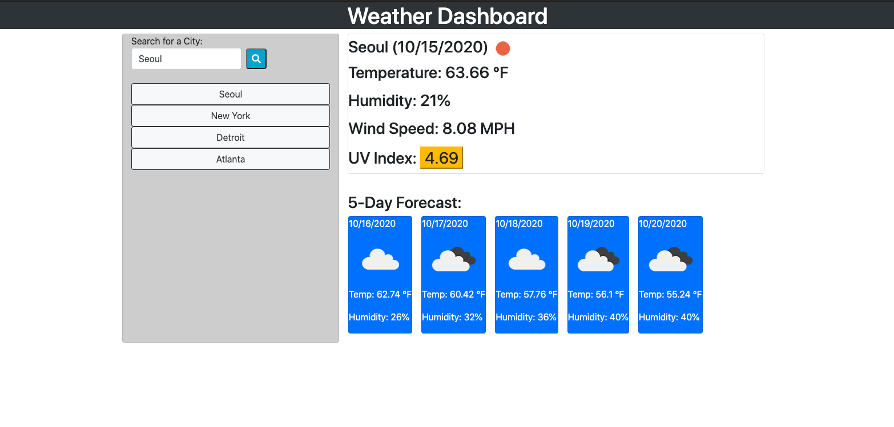

# WeatherDashboard

David K. Brown's Weather Dashboard

## Table of Contents

- [Description](#description)

- [Screenshots](#screenshots)

- [Acceptance-Criteria](#Acceptance-Criteria)

- [Installation](#installation)

- [Credits](#credits)

- [Contributing](#contributing)

- [Copyright](#copyright)

## Description

This website was created to provide a traveler the ability to see the weather outlook for multiple cities so that they can plan their trip accordingly. The website retrieves data from the Open Weather Map website using a custom API along with an assigned API Key. The code used in this website dynamically updates HTML and CSS within the webpage.

## Screenshots



## Acceptance-Criteria

```
GIVEN a weather dashboard with form inputs
WHEN I search for a city
THEN I am presented with current and future conditions for that city and that city is added to the search history
WHEN I view current weather conditions for that city
THEN I am presented with the city name, the date, an icon representation of weather conditions, the temperature, the humidity, the wind speed, and the UV index
WHEN I view the UV index
THEN I am presented with a color that indicates whether the conditions are favorable, moderate, or severe
WHEN I view future weather conditions for that city
THEN I am presented with a 5-day forecast that displays the date, an icon representation of weather conditions, the temperature, and the humidity
WHEN I click on a city in the search history
THEN I am again presented with current and future conditions for that city
WHEN I open the weather dashboard
THEN I am presented with the last searched city forecast
```

## Installation

To access this project you will need to visit my GitHub page and the "WeatherDashboard" repository. After the repository is cloned you can make edits to the project in your repository. Any questions should be directed to [David Brown](mailto:gatech55@gmail.com). The project can be found here: [WeatherDashboard](https://github.com/GaTech55/WeatherDashboard). The website can be found here: [Weather Dashboard](https://gatech55.github.io/WeatherDashboard/).

## Credits

© 2012 — 2020 OpenWeather ® All rights reserved
© 2019 Trilogy Education Services, a 2U, Inc. brand. All Rights Reserved.
[GitLab-06-Homework](https://gt.bootcampcontent.com/GT-Coding-Boot-Camp/gt-inc-fsf-pt-08-2020-u-c/tree/master/06-Server-Side-APIs/02-Homework)

## Contributing

| **Commits** | **Contributor** |

| 20 | [GaTech55](https://github.com/GaTech55)|

## Copyright

Copyright (c) 2020 David Brown.
